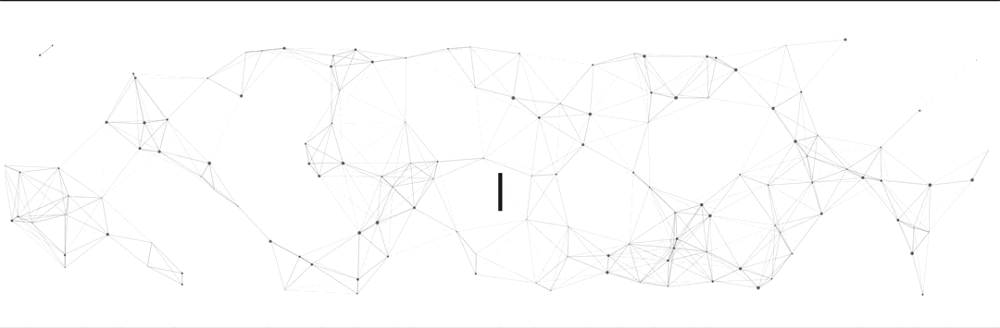

 

Hi, I am Arkoprabho Chakraborti (aka Arko).
I am a Platform Engineer, with a firm belief in philosophies of DevOps, automation and enabling builders to be creators
Solving problems around infrastructure, platform and software are core to me.

Languages and Tools I've worked with:

<code></code>
<code></code>
<code></code>
<code></code>
<code></code>

<code></code>
<code></code>
<code></code>
<code></code>
